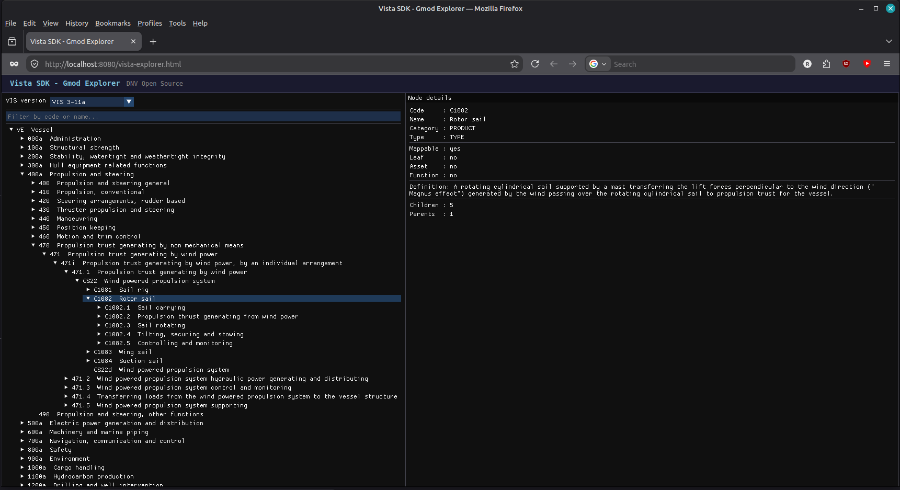

# Vista SDK - Gmod Explorer (Emscripten/WebGL)

An interactive Gmod tree browser compiled to WebAssembly, built on ImGui + GLFW (pongasoft emscripten-glfw) + WebGL 2.
It demonstrates that the Vista SDK C++ core is fully Emscripten-compatible.

## What it shows

- All VIS versions (v3.4a through latest) in a dropdown selector
- The full Gmod tree for the selected version, rendered as a collapsible tree
- Code/name filter to search across the tree in real time
- Per-node detail panel: category, type, mappability, definition, children/parents count, product type/selection

<p align="center">
  
</p>

## Prerequisites

- [Emscripten SDK](https://emscripten.org/docs/getting_started/downloads.html) activated in your shell (`emsdk activate latest && source emsdk_env.sh`)
- CMake 3.25+
- Python 3.8+ (to serve the app)

## Build

The SDK uses a host-side code generator (`blobgen`) to embed binary resources
at compile time. When cross-compiling for Emscripten, a native build of that
tool must be produced first and passed via `DNV_VISTA_SDK_BLOBGEN_HOST_PATH`.

```bash
# From the repo root

# Step 1: build native host tools (once)
cmake -S cpp -B build -G Ninja -DCMAKE_BUILD_TYPE=Release \
    -DDNV_VISTA_SDK_BUILD_TESTS=OFF \
    -DDNV_VISTA_SDK_BUILD_SAMPLES=OFF \
    -DDNV_VISTA_SDK_BUILD_BENCHMARKS=OFF
cmake --build build --target \
    dnv-vista-sdk-blobgen \
    dnv-vista-sdk-visversionsgenerator \
    dnv-vista-sdk-iso19848versionsgenerator

# Step 2: configure and build the Emscripten target
EM_CONFIG=$HOME/.emscripten emcmake cmake -S cpp -B build-wasm -G Ninja \
    -DCMAKE_BUILD_TYPE=Release \
    -DDNV_VISTA_SDK_BUILD_SAMPLES=ON \
    -DDNV_VISTA_SDK_BUILD_TESTS=OFF \
    -DDNV_VISTA_SDK_BUILD_BENCHMARKS=OFF \
    -DDNV_VISTA_SDK_BLOBGEN_HOST_PATH=$PWD/build/bin/dnv-vista-sdk-blobgen \
    -DDNV_VISTA_SDK_VISVERSIONSGENERATOR_HOST_PATH=$PWD/build/bin/dnv-vista-sdk-visversionsgenerator \
    -DDNV_VISTA_SDK_ISO19848VERSIONSGENERATOR_HOST_PATH=$PWD/build/bin/dnv-vista-sdk-iso19848versionsgenerator

EM_CONFIG=$HOME/.emscripten cmake --build build-wasm -j$(nproc) --target dnv-vista-sdk-sample-emscripten
```

The output lands in `build-wasm/bin/`:

```
vista-explorer.html
vista-explorer.js
vista-explorer.wasm
```

## Run

```bash
python cpp/samples/wasm/serve.py build-wasm/bin
# then open http://localhost:8080/vista-explorer.html
```

## SIMD note

The SDK JSON fast paths (`__m128i`) are compiled only when `__SSE2__` is
defined. Emscripten does not define `__SSE2__` by default, so the scalar
fallback is used. To enable WASM SIMD (requires a browser supporting
WebAssembly SIMD), add `-msimd128` to both compile and link flags.
